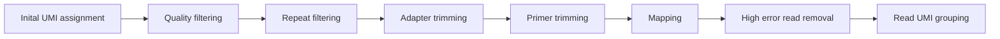

# ctRCA-Var
ctDNA variant caller for RCA consensus called data. 

This pipeline assumes that target enrichment of ctDNA moleucles has been performed with the QIASeq-pro panel, that circularisation + RCA was performed using the R2C2 protocol, and that consensus calling was peformed with either C3POa or BB-8

## Pipeline overview

This pipeline is designed for consensus called nanopore reads from BB-8 (or C3POa) as input. ctRCA-Var outputs mutation annotation format tsv files at the end of the pipeline.
The preprocessing file is as follows. Usage instructions for each step in this process are in the `Preprocessing Instructions` MarkDown file

After preprocessing, BAM files are ready for ctRCA-Var variant calling

## ctRCA-Var Usage
ctRCA-Var can be run using command line arguments or through a config file. Command line arguments take precedence over the config file; however, if the same genome, BED file, etc are consistanely re-used it is helpful to add them to the config to prevent excessive commandline arguments.

Example Usage:
`python your_script.py --input <input_directory> [options]`
`--input` is required, and points to a directory (NOT a file). All files with the `bam` suffix will be processed.

ctRCA-Var has several options:
| Argument                | Value                | Description                                                                         |
| ----------------------- | -------------------- | ----------------------------------------------------------------------------------- |
| --input                 | ./bam_files          | The directory location containing input BAM files                                   |
| --output                | ./results            | The directory location where files will end up (defaults to input directory)        |
| --genome                | ./ref/genome.fa      | Path to the reference genome                                                        |
| --bedfile               | ./targets.bed        | Path to a BED file; only loci in this file will be analysed                         |
| --control_refset        | ./controls/          | Path to control sample refset files; required for Dirichlet-multinomial analysis    |
| --exon_bed              | ./ref/exons.bed      | Path to exon boundary BED file; used to determine if variants are in coding regions |
| --cds_fasta             | ./ref/cds.fa         | Path to canonical CDS sequences                                                     |
| --target_variants       | ./filters/variants.tsv | Path to target variants filter file                                                 |
| --UMI_cutoff            | 3                    | Minimum number of reads in a UMI family; families below this are ignored            |
| --UMI_proportion        | 0.75                 | Proportion of reads in a UMI group containing a mutation (0.0–1.0)                  |
| --strand_bias_threshold | 0.01                 | Significance threshold for strand bias using Fisher's exact test                    |
| --minimum_coverage      | 100                  | Minimum read coverage required when determining relevant mutations                  |
| --minimum_vaf           | 0.005                | Minimum variant allele frequency                                                    |
